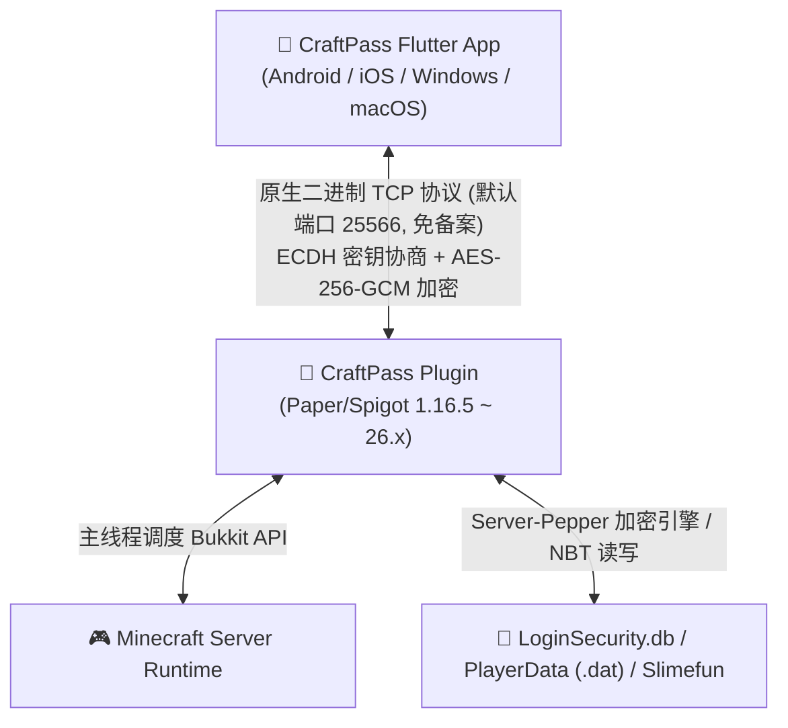

# CraftPass

[](LICENSE)
[](https://github.com/nimenhagg/CraftPass/actions/workflows/build-and-release.yml)
[](https://papermc.io)
[](https://flutter.dev)

> **CraftPass** 是专为 Minecraft 打造的**零 HTTP、免 ICP 备案、银行级密码防护**的玩家全平台账户与随身金库管家系统。包含一个高兼容服务端插件（`craftpass-plugin`）与跨平台 Flutter 客户端（`craftpass-app`）。

---

## 🌟 核心特性 (Features)

### 1. ⚡ 零 HTTP 原生 TCP 协议（彻底免 ICP 备案）
* **免备案原理**：国内云厂商对未备案域名的 HTTP/HTTPS 协议（80/443 及任何端口上的 `GET/POST` 请求）具有严格的 DPI 嗅探拦截；
* CraftPass 底层基于**纯原生 TCP 二进制流（自定义 Magic 魔数 `0x4350`）**，行为特征与 Minecraft 游戏包（`25565`）完全一致，**绝不触发 Web/HTTP 阻断，100% 免备案稳定直连**。

### 2. 🛡️ 公开数据库防御体系（Server-Side Pepper + 零知识握手）
* **痛点场景**：如果您的服务器经常向社区公开发布数据库备份（如包含密码哈希的 `LoginSecurity.db`），传统哈希极易被黑客用 RTX 4090 进行离线 GPU 字典爆破；
* **双层防线**：
  * **服务端胡椒密钥 (Server-Side Pepper)**：引入独立的 256 位高熵密钥，只存于服务端本地配置文件，**绝不写入数据库**。攻击者即使下载了公开数据库，没有 Pepper 密钥，**任何 GPU 离线爆破工具（Hashcat/John）连第一道哈希门槛都过不去**！
  * **传输零密码明文**：握手基于单次随机挑战 Nonce 与临时 ECDH 密钥派生，通信数据全程 AES-256-GCM 加密，彻底免疫网络嗅探与中间人攻击。
  * **无感平滑升级**：老玩家首次通过 CraftPass 认证时，系统自动在底层将其旧哈希原地升级为加盐加胡椒的 Peppered-BCrypt。

### 3. 🎒 随身背包与末影箱实时查验
* 在手机/桌面端 1:1 还原经典 Minecraft 槽位布局：**36 格背包、4 件装备槽、副手及 27 格末影箱**；
* 点击任意物品可查看完整的自定义名称、附魔等级、耐久度百分比与彩色 Lore 描述。

### 4. 🔑 在线密码修改
* 玩家可在 App 端一键更新游戏登录密码；
* 自动同步原子写入 `LoginSecurity.db`，并踢出游戏中旧会话，强制重新登录。

### 5. 🔄 自助改名数据无损平移
* 换新名字进服后，在 App 端输入新用户名，系统自动执行原子级平移：
  * 原版世界背包、末影箱、血量、经验（`playerdata`）
  * 成就统计进度（`stats` & `advancements`）
  * Multiverse-Inventories 多世界独立背包
  * Slimefun (粘液科技) 解锁配方与背包数据
  * CoreProtect 历史记录与 LoginSecurity 登录凭据
* 迁移前自动生成带时间戳的安全回滚快照。

### 6. 🌐 Java ↔ Geyser 基岩版双端互通
* 针对基岩版玩家自带前缀（如 `Steve` 与 `.Steve`）：
* **双向认证绑定**：在 App 中输入基岩版凭据即可完成一对一互通绑定；
* **下线自动镜像**：任一账号退出服务器时，拦截器自动将最新背包与经验实时镜像覆盖至绑定的另一端；
* **互斥在线防护**：严格禁止两端同时在线，防止刷物品与数据竞争。

---

## 🏛️ 系统架构 (Architecture)



---

## 📦 兼容版本范围 (Compatibility)

CraftPass 插件采用无 NMS 绑定的纯 Java 原生 NBT 引擎与 Spigot/Paper 跨版本反射定位器，支持极广的服务端版本：

| 服务端核心 | 支持版本 | 状态 |
|---|---|:---:|
| **Paper / Purpur** | 1.16.5 ~ 1.20.x, 1.21.x, **Paper 26.x** | ✅ 完美支持 |
| **Spigot** | 1.16.5 ~ 1.21.x | ✅ 完美支持 |
| **Java 运行环境** | Java 17, Java 21, **Java 25** | ✅ 完美支持 |
| **登录插件集成** | LoginSecurity 2.x, 3.x (SQLite / MySQL) | ✅ 原生支持 |
| **多世界背包** | Multiverse-Inventories 全系列 | ✅ 原生支持 |
| **科技模组插件** | Slimefun 4 (v5.x 全系列) | ✅ 原生支持 |
| **移动端/基岩版** | Geyser-Spigot + floodgate | ✅ 原生支持 |

---

## 🚀 快速开始 (Quick Start)

### 1. 服务端安装
1. 前往 [Releases](https://github.com/nimenhagg/CraftPass/releases) 下载最新的 `CraftPass-1.0.0.jar`；
2. 放入服务器的 `plugins/` 目录；
3. 重启服务器。首次启动将在 `plugins/CraftPass/config.yml` 中自动生成唯一的 256 位 `server-pepper` 密钥；
4. 确保服务器防火墙开放 TCP 端口（默认 `25566`）。

### 2. 客户端使用
1. 在 [Releases](https://github.com/nimenhagg/CraftPass/releases) 下载 Android APK（`CraftPass-v1.0.0.apk`）或桌面客户端；
2. 输入服务器 IP、TCP 端口、游戏角色用户名和当前登录密码，点击「安全连接并登录」即可！

---

## 🛠️ 编译构建 (Build from Source)

### 编译服务端插件
```bash
cd craftpass-plugin
mvn clean package
# 产物输出在 target/CraftPass-1.0.0.jar
```

### 编译 Flutter 客户端
```bash
cd craftpass-app
flutter pub get
# 编译 Android APK
flutter build apk --release
# 或编译 Windows 桌面端
flutter build windows
```

---

## 📄 开源许可 (License)

本项目采用 **[GNU General Public License v3.0 (GPLv3)](LICENSE)** 协议开源。
* 你可以自由部署、修改和二次开发；
* **任何基于本项目的衍生版本，分发传播时必须以相同开源协议开源全部源码**；
* 坚决反对并禁止将本开源作品闭源打包进行商业性倒卖。
