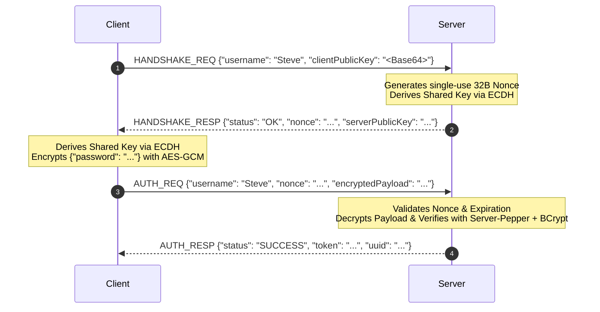

# CraftPass Protocol Specification

> **Non-HTTP Raw TCP Binary Framing Protocol (ICP-Exempt)**

---

## 1. Design Principles

1. **Zero HTTP Signatures**:
   - Cloud provider firewalls in mainland China perform Deep Packet Inspection (DPI) looking for HTTP keywords (`GET`, `POST`, `HTTP/1.1`) or unfiled domain SNI on all ports.
   - CraftPass communicates via **pure raw TCP binary streams** using custom Magic framing (`0x4350`, "CP"), completely indistinguishable from native Minecraft game packets (`25565`).
   - No HTTP web server, no reverse proxy, no domain SNI, **100% exempt from ICP filing**.

2. **Wire Confidentiality & Anti-MITM**:
   - Ephemeral ECDH (Elliptic-Curve Diffie-Hellman) key exchange establishes a per-connection symmetric 256-bit AES-GCM encryption key.
   - Zero plaintext passwords over the wire.

3. **Anti-Replay**:
   - Single-use 32-byte cryptographically secure challenge nonces with 60-second TTL.

---

## 2. Frame Structure

Every packet sent between client and server follows this 8-byte header structure:

```text
+-------------------+-------------------+-------------------+-----------------------+
|  TotalLength (4B) |    Magic (2B)     |   OpCode (2B)     |  Payload (Variable)   |
|   big-endian int  |  0x4350 ('C''P')  | big-endian short  |   UTF-8 JSON bytes    |
+-------------------+-------------------+-------------------+-----------------------+
```

- **`TotalLength`**: `4 + PayloadLength` (in bytes). Maximum allowed packet size is 1 MB (`1048576` bytes).
- **`Magic`**: Fixed short `0x4350` (ASCII `'C'` `'P'`). Any packet with a mismatched magic is immediately dropped and connection closed.
- **`OpCode`**: Operation identifier (see below).
- **`Payload`**: UTF-8 encoded JSON string (either plaintext for handshake or AES-256-GCM encrypted).

---

## 3. OpCodes Reference

| OpCode | Hex | Name | Sender | Description |
|---|---|---|---|---|
| `1` | `0x0001` | `HANDSHAKE_REQ` | Client | Initiates connection, sends `username` and client public key |
| `2` | `0x0002` | `HANDSHAKE_RESP` | Server | Returns `nonce`, `serverPublicKey`, and status |
| `3` | `0x0003` | `AUTH_REQ` | Client | Authenticates with `username`, `nonce`, and password payload |
| `4` | `0x0004` | `AUTH_RESP` | Server | Returns `sessionToken`, player UUID, or lockout error |
| `5` | `0x0005` | `GET_INVENTORY_REQ` | Client | Requests player inventory, armor, offhand, ender chest |
| `6` | `0x0006` | `GET_INVENTORY_RESP` | Server | Returns structured inventory DTO |
| `7` | `0x0007` | `CHANGE_PASSWORD_REQ` | Client | Submits old & new password for update |
| `8` | `0x0008` | `CHANGE_PASSWORD_RESP` | Server | Returns password change status |
| `9` | `0x0009` | `MIGRATE_ACCOUNT_REQ` | Client | Requests account data migration to new username |
| `10` | `0x000A` | `MIGRATE_ACCOUNT_RESP` | Server | Returns migration result and audit status |
| `11` | `0x000B` | `GET_GEYSER_LINK_REQ` | Client | Queries Geyser Bedrock link status |
| `12` | `0x000C` | `GET_GEYSER_LINK_RESP` | Server | Returns linked Bedrock username and prefix |
| `13` | `0x000D` | `LINK_GEYSER_REQ` | Client | Binds Java account to Bedrock account |
| `14` | `0x000E` | `LINK_GEYSER_RESP` | Server | Returns binding result |
| `15` | `0x000F` | `UNLINK_GEYSER_REQ` | Client | Unbinds Bedrock account |
| `16` | `0x0010` | `UNLINK_GEYSER_RESP` | Server | Returns unbind status |
| `254` | `0x00FE` | `HEARTBEAT` | Both | Keepalive ping/pong timestamp |
| `255` | `0x00FF` | `ERROR` | Server | General protocol error |

---

## 4. Authentication Flow


